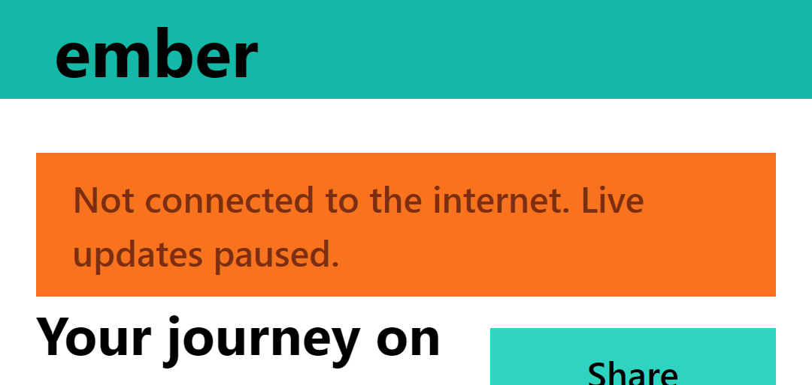
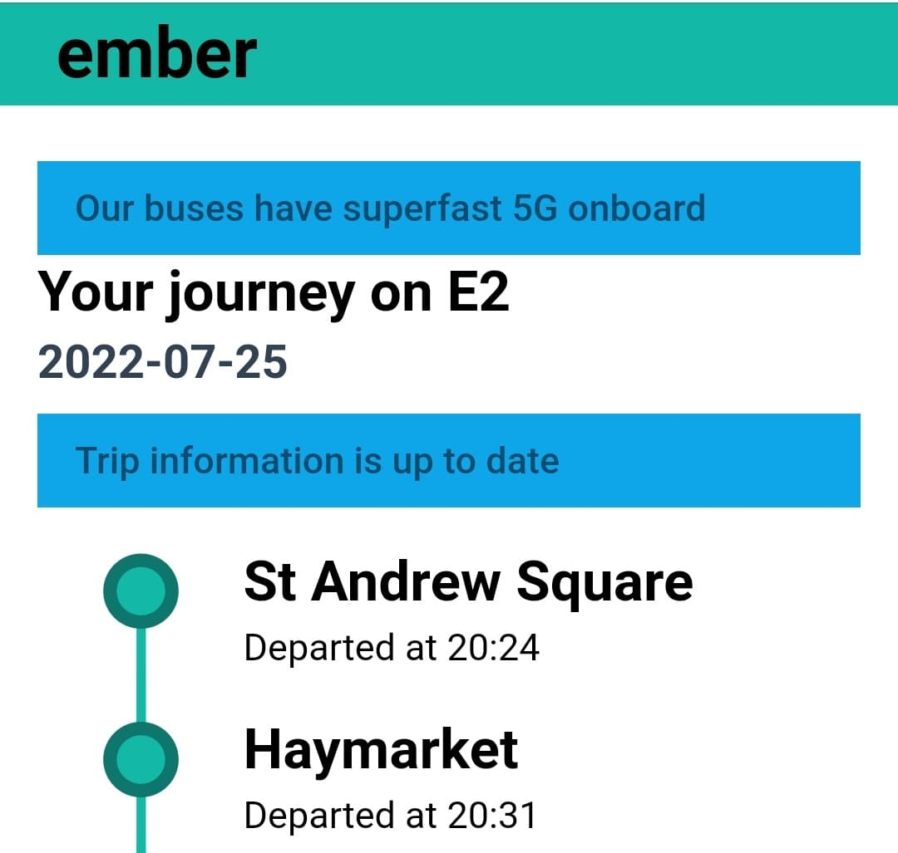
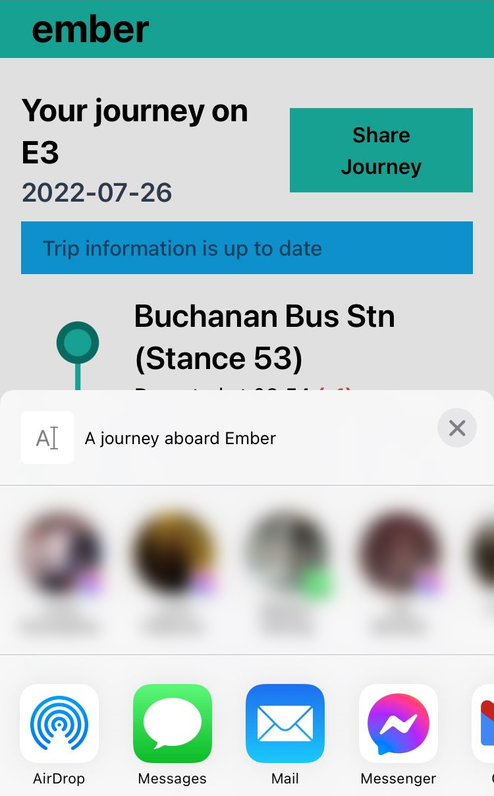

# Ember Trip Project

> View list of trips online at https://ember-conorhaining.vercel.app/trips

I've had fun doing this project, and I feel very happy with what I have produced so far. I'll provide an overview of the tech stack, a few bits of interesting features, what I didn't do & why, and improvements I want to make if given the time to continue tinkering.

## Technology

This is a React app using NextJS w/ Typescript as a framework. React is where I am trying to grow my own skills, and matches what is in use at Ember. I chose NextJS for its server rendering capabilities.

Styles come from TailwindCSS. I think Tailwind is a fantastic framework when you are prototyping a design, but don't need something heavy-handed like Bootstrap. I'm aware of other style libraries in the React ecosystem, but don't yet have first-hand experience with them.

There are a number of component level tests using Jest, and the React Testing Library. These are a bit more limited than I would like as I'm still picking up testing in this ecosystem, but I've covered the key areas. I didn't want to go as far as setting up Cypress (or a different integration level test) at this point for one page, but it is something I would like to do.

The application is deployed on Vercel, only because of easy of deployment, but any vendor would be suitable.

## Product Features

I spent some time thinking of the context of the user when using this view. Chances are they will be using a mobile device, and not necessarily connected to a fast/stable wifi connection. For that reason, I've gone for a mobile first design, which is a standard single column. 

Using NextJS / server rendered components allowed me to ensure that pages were as small as possible. A trip page is approx ~120kB over the wire on first load. On a simulated mobile device (Lighthouse), the page is ready in around a second, and there are plenty of opportunities for optimisation.

### Page Overview

The trip page displays a list of stops for that trip. Each stop has the name of that stop, and a particular time. There is some logic behind the scenes to determine if this is a scheduled future stop, one with an estimated time, one which has already happened. There's also a time difference indicator to show if a trip is running ahead or behind schedule, when the difference is larger than a minute.

Skipped stops are greyed out to indicate that the trip isn't stopping there.

Data is polled and updated in the background, so the application re-renders a stop point when something has changed.

### Offline Alert

Because network stability cannot always be guaranteed since it's possible that the user is not on a stable connection, I am listening for when a user loses connection to internet an alert appears informing them and that live updates are paused.

### Network Connection Type Alert

[Where supported](https://caniuse.com/mdn-api_networkinformation), I am listening for what kind of network a user is on. If they are connected to anything which is not wifi, I advertise that Ember buses have superfast 5G onboard. When the Network Information API isn't supported, this is not displayed at all.

### Live Updates

The list of stops & their departure times are updated behinds the scenes. As before, this is paused when the user has no connection. The polling frequency is determined by the Network Information API, [where supported](https://caniuse.com/mdn-api_networkinformation). If the user is connected to WiFi, they'll get more frequent updates (5s), and when they have a fast (non-wifi) connection, they will receive updates every 15s. If neither of these are true, or the NetworkInformation API is not supported, then the default is every 30s.

These frequencies may be too often for a real world use case, but is more to show way the application handle different networks.

### Web Share

;

Using the Web Share API, [where supported](https://caniuse.com/web-share), each trip has a "Share Journey" button, which will bring up the device's native share panel, which will send the page URL to whichever application the user choses. As before, this button isn’t displayed when the API is not supported.

## What I did not do

### A Map

I think the next obvious step is showing the bus location on a map with the route, however I've done a lot of work with maps in the past so wanted to explore other things at this point. I think there's also potential to combine the Network Information API and the online/offline events with a map to provide a better experience which doesn't hammer a person's data or device. 

### More through testing

I think the `<StopPoint>` component, where the time is displayed and with a verb related to that time is quite complicated and tricky to wrap your head around. Out of the 6 possible timestamps given in relation to the current stop, and when to display which. I feel comfortable with the logic and coverage, but I think it could be revisited.

## What I'd like to do next

### Why stops are skipped

I have a hunch that to many passengers, the idea of stop skipping has a bad reputation for when a trip is running late whereas the truth in Ember's case is a bit different. I think a bit of user education about why stops are skipped/reservation only in this view might be of interest. I was thinking either a tooltip or some sort of accordion, but just did not get to that point.

### Where are the bus stops

I think some stop names are too vague to pinpoint where the bus actually stops. I'd perhaps include a link to the stop location on Google Maps, or if a map were to be included in the application, then utilise that.

### Current Location Indicator

The left hand-side stop indicator graphic would benefit from showing where in a journey an in-progress journey is, as this isn't clear from the current view other than the difference between "Departed at .." and "Estimated at .." on the stop point.

